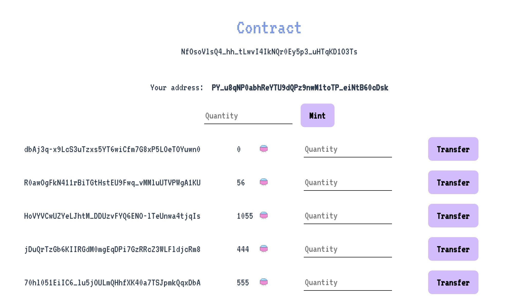

# Intro

Ok, time for our first dApp!

## 👷 What we will build?

In this tutorial we're going to learn how to build a simple PST (Profit Sharing Tokens) application. Our main tokens will be Federation Credits which are monetary units used by the United Federation of Planets. You can read some more about this fictional unit in the [Star trek fandom wiki](https://memory-alpha.fandom.com/wiki/Federation_credit). In order to achieve that, we will write our first PST contract. After writing some tests, we will deploy it to the [RedStone public testnet](https://testnet.redstone.tools/). It will let us mint some tokens as well as transfer them between addresses and read addresses' current balances. We will then create a simple dApp which will help us interact with the contract in a user-friendly way.

We will also give you some advices of how to deploy the contract to the Arweave mainnet.



## 🔨 What you will need

- [Node.js](https://nodejs.org/en/download/) version 16.5 or above:
- [yarn](https://yarnpkg.com/getting-started/install) installed

## 🔗 Links

We've already deployed final versions of PST contract and application.
You can view contract in the contracts explorer - [SonAR](https://sonar.redstone.tools/#/app/contract/NfOsoVlsQ4_hh_tLwvI4IkNQr0Ey5p3_uHTqKD1O3Ts?network=testnet). Application is available [here](https://pst.redstone.academy).

In order to complete this tutorial you will need to fork [redstone-academy repository](https://github.com/redstone-finance/redstone-academy), head to [redstone-academy-pst/challenge](https://github.com/redstone-finance/redstone-academy/tree/main/redstone-academy-pst/challenge) folder and complete all the tasks in the next sections by writing some code.

```bash
git clone git@github.com:<username>/redstone-academy.git
cd redstone-academy/redstone-academy-pst/challenge
```

No worries, we will guide you through the whole process!

You can also run final version locally by running following commands:

```bash
cd redstone-academy-pst/final
yarn install
yarn serve
```
